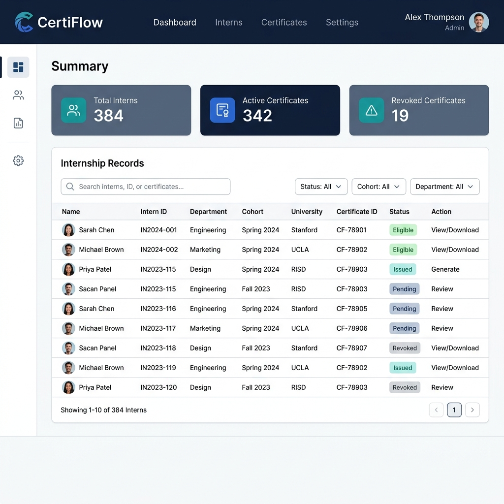
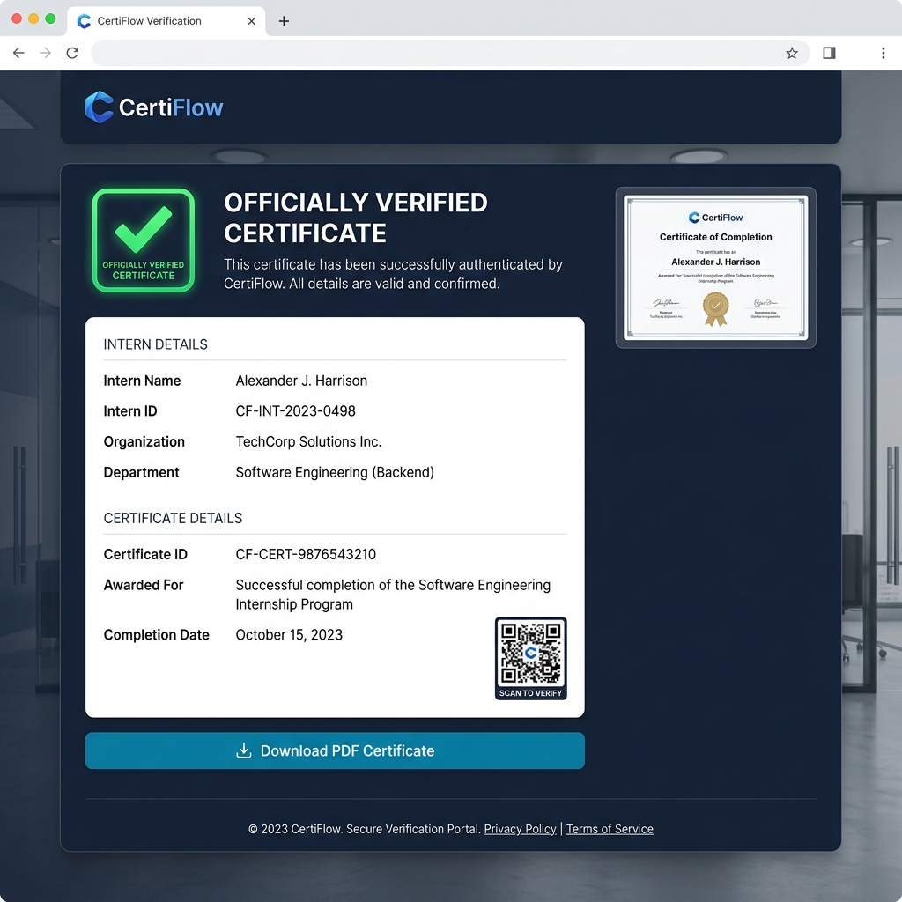
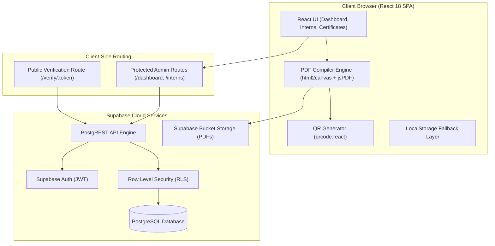
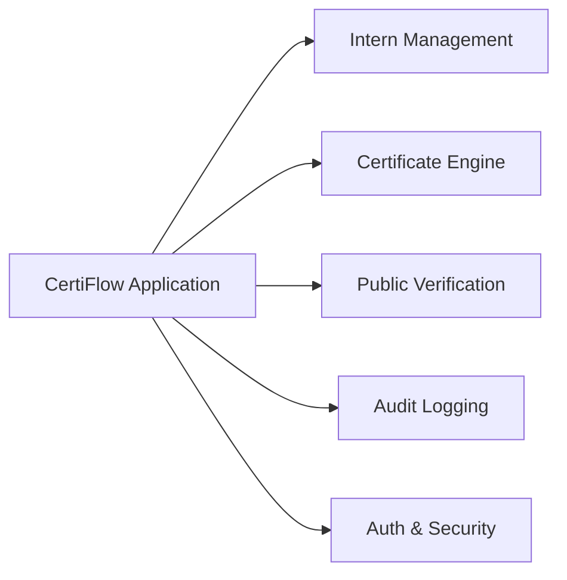
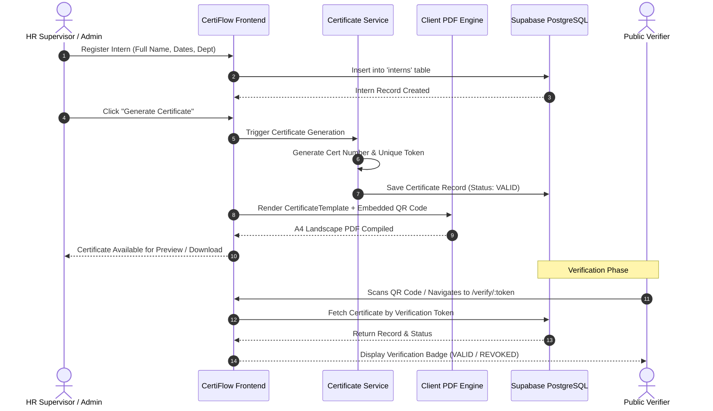
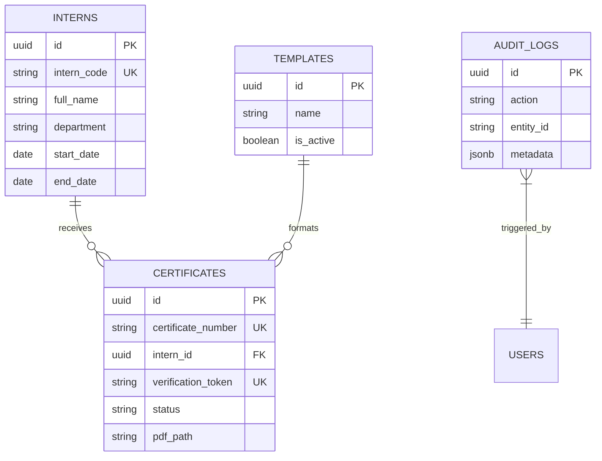
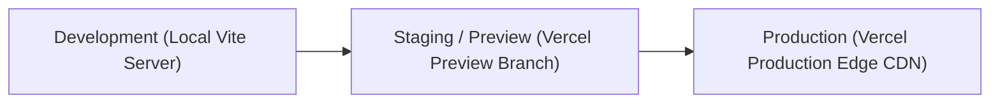

# CertiFlow — Comprehensive System Documentation

---

## 1. Cover Page

| Field | Detail |
| :--- | :--- |
| **Project Name** | **CertiFlow** — Internship Certificate Generation & Verification Platform |
| **Application Version** | `1.0.0` |
| **Document Version** | `1.0.0` |
| **Prepared By** | CertiFlow Core Engineering & HPS Operations Team |
| **Last Updated** | September 5, 2026 |
| **Document Status** | Approved & Released |

---

## 2. Project Summary

### 🎯 Purpose of the Project
**CertiFlow** is a web-based enterprise application engineered to automate the lifecycle management, issuance, PDF rendering, and public verification of internship completion certificates. It eliminates manual certificate preparation by combining structured data intake, dynamic template filling, QR-code cryptographic token embedding, and instant public validation.

### 💼 Business Problem It Solves
Historically, organizations managed internship certificates through manual document editing (e.g., Word templates or graphic software). This workflow introduced:
- ❌ **Repetitive administrative overhead** and high operational costs.
- ❌ **Human typings errors** in intern names, dates, or titles.
- ❌ **Formatting inconsistencies** across departments.
- ❌ **Zero verification mechanism** for third parties (employers/universities) to check credential authenticity, enabling certificate forgery.
- ❌ **Lack of centralized audit trails** when certificates are modified or revoked.

### 👤 Intended Users
1. **Administrators**: System management, user access control, global audit compliance, certificate revocation & restoration.
2. **Supervisors / HR Users**: Intern data registration, internship tracking, single-click certificate generation, PDF download.
3. **Public Verifiers**: Third-party recruiters, background screeners, academic institutions, and candidates scanning QR codes to instantly verify certificate validity without logging in.

### 🟢 Current Status
**Production / Active Maintenance** — Fully functional, featuring high-availability database integration with Supabase and resilient fallback local state capabilities.

---

## 3. Business Context

### ❓ Why Was This Project Built?
CertiFlow was built to modernize company operations by replacing fragmented manual certificate creation with a centralized, immutable, and verifiable digital credential engine.

### 🛡️ What Problem Does It Solve?
- **Fraud Prevention**: Eliminates fake or tampered completion certificates through unique verification tokens linked to live database records.
- **Operational Velocity**: Reduces certificate issuance time from 30+ minutes per intern down to seconds.
- **Audit & Compliance**: Tracks every generation, revocation, and restoration event with explicit user logging.

### 📈 Expected Business Value
- **95% Reduction** in certificate issuance labor hours.
- **100% Assurance** of credential authenticity for third-party verifiers.
- **Zero Ongoing Infrastructure Overhead** due to serverless cloud architecture.

---

## 4. System Overview

### 💡 High-Level Application Description
CertiFlow operates as a responsive Single Page Application (SPA). Authorized HR staff manage intern records via an administrative dashboard. When an internship is completed, the system dynamically compiles intern details into a standardized company template, embeds a generated QR code targeting a public verification route (`/verify/:token`), renders a print-ready PDF, and persists the record to cloud storage.

### 🖼️ System Interface Mockups

#### Enterprise Admin Dashboard


#### Public Verification Interface


---

### 🏗️ High-Level Architecture Diagram



---

## 5. Technology Stack

| Layer | Technology | Version | Purpose & Selection Rationale |
| :--- | :--- | :--- | :--- |
| **Frontend Framework** | React | `18.3.1` | Component-based UI rendering, state management, fast virtual DOM. |
| **Build Tool & Bundler** | Vite | `5.4.8` | Lightning-fast HMR and optimized production build bundling. |
| **Styling & Design System** | Tailwind CSS | `3.4.13` | Utility-first CSS framework ensuring responsive, clean enterprise aesthetics. |
| **Corporate Brand Theme** | HPS Blue & White | Standard | Primary Navy `#0B2545`, Royal Blue `#134074`, Accent Blue `#0077B6`, Surface `#FFFFFF`. |
| **Icons** | Lucide React | `0.446.0` | Crisp visual icons for administrative interface elements. |
| **Form Handling & Validation** | React Hook Form + Zod | `7.53.0` / `3.23.8` | Declarative, high-performance form state management with strict schema runtime checks. |
| **Client Routing** | React Router DOM | `6.26.2` | Client-side page navigation with protected auth guards. |
| **PDF Rendering** | `html2canvas` + `jsPDF` | `1.4.1` / `2.5.2` | DOM-to-canvas rendering & A4 landscape PDF document compilation. |
| **QR Code Encoding** | `qrcode.react` | `4.0.1` | Dynamic vector QR code generation for verification tokens. |
| **Backend & Database** | Supabase (PostgreSQL) | `15.x` | Managed cloud database, PostgREST API engine, and serverless authentication. |
| **Cloud Hosting** | Vercel / Static CDN | — | High-availability global deployment with SPA route rewrites. |

---

## 6. Major Modules



### 1. 👥 Intern Management Module
- **Purpose**: Centralized storage and management of intern profiles.
- **Responsibilities**: Registration, departmental tagging, eligibility calculation based on internship start/end dates.
- **Main Features**: Intern list filtering, pagination, search by code/name, Add/Edit modal dialogs.
- **Dependencies**: `internService.js`, Supabase `interns` table, `React Hook Form`.

### 2. 📜 Certificate Generation & Management Module
- **Purpose**: Dynamic generation, tracking, and status control of completion certificates.
- **Responsibilities**: Certificate number sequence generation (`HPS/2026/XXX`), verification token synthesis, PDF compilation, status mutations (VALID ↔ REVOKED).
- **Main Features**: Single-click issue, certificate preview modal, PDF export, revocation modal with explicit reason logging.
- **Dependencies**: `certificateService.js`, `CertificateTemplate.jsx`, `html2canvas`, `jsPDF`.

### 3. 🔍 Public Verification Module
- **Purpose**: Authenticates certificates for third-party verifiers without requiring login credentials.
- **Responsibilities**: Token matching, status lookup, public credential rendering.
- **Main Features**: Instant badge verification (VALID / REVOKED / INVALID), metadata display, PDF view/download link.
- **Dependencies**: `VerifyCertificate.jsx`, public Supabase RLS select policy.

### 4. 📊 Audit Logging Module
- **Purpose**: Compliance tracking and system event auditability.
- **Responsibilities**: Captures certificate issuance, revocation, and restoration actions with timestamps and actor metadata.
- **Main Features**: Audit logs data table, action category filter, metadata drawer.
- **Dependencies**: `auditService.js`, Supabase `audit_logs` table.

### 5. 🔐 Authentication & Access Control Module
- **Purpose**: Protects administrative features from unauthorized access.
- **Responsibilities**: Session token verification, login/logout context, protected route authorization wrappers.
- **Main Features**: `AuthContext.jsx`, `ProtectedRoute`, `PublicOnlyRoute`.
- **Dependencies**: Supabase Auth / LocalStorage fallback session.

---

## 7. System Workflow

### 🔄 End-to-End Operational Flowchart



---

## 8. Data Model

CertiFlow relies on four primary database entities configured with relational keys and Row Level Security.



### Entity Summary
- **`interns`**: Stores intern demographic, academic, and internship schedule details.
- **`certificates`**: Stores issued certificate numbers, verification tokens, status (`VALID`, `REVOKED`), and PDF paths.
- **`templates`**: Manages certificate layout templates and active versions.
- **`audit_logs`**: Captures historical administrative operations for compliance.

---

## 9. External Integrations

| External Service | Purpose | Integration Method |
| :--- | :--- | :--- |
| **Supabase Database & Auth** | Real-time PostgreSQL database, JWT authentication, and PostgREST endpoints. | `@supabase/supabase-js` SDK |
| **Supabase Storage** | Secure cloud storage bucket for generated certificate PDF documents. | Supabase Storage API |
| **Vercel / Hosting Provider** | CDN edge hosting, automatic SSL certificates, SPA routing. | Vercel Deployment Engine |

---

## 10. Configuration

### 🔑 Environment Variables
Defined in `.env.local` (do not commit production secrets to version control):

```env
# Supabase Project Base URL
VITE_SUPABASE_URL=https://your-project-id.supabase.co

# Supabase Anonymous Public API Key
VITE_SUPABASE_ANON_KEY=eyJhbGciOiJIUzI1NiIsInR5cCI6IkpXVCJ9...
```

### 📁 Key Configuration Files
- **`package.json`**: Application metadata, script definitions, and dependency lock targets.
- **`vite.config.js`**: Vite dev server config, React plugin setup, path resolve aliases.
- **`tailwind.config.js`**: Theme colors, fonts, spacing, responsive breakpoint definitions.
- **`postcss.config.js`**: Autoprefixer and Tailwind PostCSS processing pipeline.
- **`vercel.json`**: Single Page Application rewrite rules for clean client routes.

---

## 11. Deployment Overview

### 🌐 Environments



1. **Development Environment**: Local Node.js runtime (`http://localhost:5173`) using Vite dev server with LocalStorage or Supabase test project.
2. **Staging Environment**: Automated Vercel preview builds triggered on GitHub pull requests.
3. **Production Environment**: Vercel Global Edge Network connected to production Supabase Cloud project with custom domain and HTTPS.

---

## 12. Project Structure

```
CertiFlow/
├── .agents/                    # Custom AI agent skill configurations
├── docs/                       # Comprehensive documentation suite & visual assets
│   ├── assets/                 # High-resolution UI mockups and diagrams
│   ├── API_DOCUMENTATION.md    # Complete API reference
│   ├── DATABASE_SCHEMA.md      # Detailed database schema & RLS policies
│   ├── DEPLOYMENT_GUIDE.md     # Production deployment instructions
│   ├── DEVELOPER_ONBOARDING.md # New developer setup guide
│   ├── TESTING_GUIDE.md        # QA & validation test procedures
│   └── USER_MANUAL.md          # HR & administrative user manual
├── public/                     # Static assets (favicons, company certificate templates)
├── src/                        # Main application source code
│   ├── components/             # Reusable UI elements, layouts, and certificate templates
│   │   ├── certificates/       # Certificate rendering template & preview modal
│   │   ├── layout/             # Header, Sidebar, AppLayout wrappers
│   │   └── ui/                 # Buttons, Cards, Inputs, Modals, Tables, Badges
│   ├── context/                # Global React Context providers (AuthContext)
│   ├── pages/                  # Top-level route pages (Dashboard, Interns, Verification)
│   ├── routes/                 # Client-side router configuration (AppRoutes)
│   ├── services/               # Data access services (Supabase & fallback handling)
│   └── utils/                  # Helper utilities (token generation, date math)
├── supabase/                   # Database migrations and RLS initialization scripts
├── DOCUMENT.md                 # Master application system documentation (This File)
├── package.json                # Project dependencies and script runner
├── README.md                   # Repository overview and quickstart
└── vite.config.js              # Vite build configuration
```

---

## 13. Known Limitations & Technical Debt

1. **Client-Side PDF Generation**: PDF rendering currently uses `html2canvas` and `jsPDF` inside the browser browser tab. Large batch generations (100+ certificates simultaneously) should be migrated to a serverless Edge Function / Puppeteer renderer in future releases.
2. **Postponed Features**:
   - Automated email dispatch of PDF certificates to intern email addresses.
   - Multi-tenant organization support.
   - Automated scheduled background cron jobs.
3. **Scalability Considerations**: Client-side LocalStorage fallback is capped at 5MB, designed strictly as a backup when Supabase cloud connectivity is degraded.

---

## 14. Maintenance & Operations

### 🛡️ Backup Strategy
- **Database Backups**: Supabase managed automated daily PostgreSQL snapshots with point-in-time recovery (PITR).
- **Storage Backups**: Certificate PDFs replicated across cloud object storage.

### 📝 Logging & Monitoring
- Operational errors are captured via browser console logger and logged to the `audit_logs` database table.
- System metrics and API bandwidth monitored via Supabase Dashboard.

### 🔧 Troubleshooting Quick Reference
- **Issue: "Supabase connection fallback warning"**  
  *Solution*: Verify `.env.local` contains valid `VITE_SUPABASE_URL` and `VITE_SUPABASE_ANON_KEY`.
- **Issue: "Certificate PDF download renders blank/misaligned"**  
  *Solution*: Ensure custom fonts are preloaded before triggering `html2canvas` render call.

---

## 15. Changelog

| Version | Release Date | Summary of Changes | Author |
| :--- | :--- | :--- | :--- |
| **`v1.0.0`** | September 5, 2026 | Initial production release. Complete intern management, single-click HPS certificate generation, QR code verification, PDF download, audit logging, and Supabase integration with LocalStorage fallback. | CertiFlow Team |

---

## 16. References & Separate Documentation Suite

For specialized operational tasks, please refer to the dedicated documentation files maintained within the [`docs/`](docs/) directory:

- 🔗 [API Documentation](docs/API_DOCUMENTATION.md) — Endpoint specifications, request parameters, and response schemas.
- 🔗 [Database Schema](docs/DATABASE_SCHEMA.md) — PostgreSQL table definitions, foreign key constraints, and RLS policies.
- 🔗 [Deployment Guide](docs/DEPLOYMENT_GUIDE.md) — Step-by-step instructions for hosting on Vercel and configuring Supabase.
- 🔗 [Testing Guide](docs/TESTING_GUIDE.md) — Test strategies, Zod schema validation, and fallback verification.
- 🔗 [Developer Onboarding Guide](docs/DEVELOPER_ONBOARDING.md) — Local environment setup and contribution guidelines.
- 🔗 [End User Manual](docs/USER_MANUAL.md) — Step-by-step operational manual for HR supervisors and administrators.
