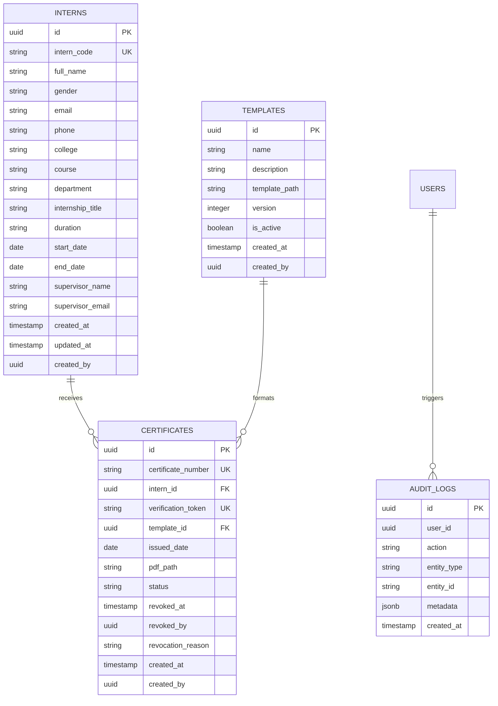

# CertiFlow — Database Schema Documentation

**Document Version:** 1.0.0  
**Last Updated:** September 5, 2026  
**Engine:** PostgreSQL 15 / Supabase  

---

## 🗄️ Database Architecture Overview

The database is built on PostgreSQL with **Row Level Security (RLS)** enabled across all core operational tables. UUID version 4 keys serve as primary identifiers across tables.

---

## 📊 Entity Relationship Diagram (ERD)

---

## 🛡️ Security & Row Level Security (RLS) Policies

### 1. `interns` Table
- **SELECT Policy:** `Authenticated users can select interns` (`to authenticated USING (true)`)
- **ALL Policy:** `Authenticated users can insert/update interns` (`to authenticated USING (true)`)

### 2. `certificates` Table
- **SELECT Policy (Public):** `Anyone can view valid/revoked certificate for verification` (`to anon, authenticated USING (true)`)
- **ALL Policy (Admin):** `Authenticated users can generate and manage certificates` (`to authenticated USING (true)`)

### 3. `audit_logs` Table
- **SELECT Policy:** `Authenticated users can view audit logs` (`to authenticated USING (true)`)
- **INSERT Policy:** `Authenticated users can insert audit logs` (`to authenticated WITH CHECK (true)`)

---

## ⚡ Extensions & Indexes

- **UUID Extension:** `CREATE EXTENSION IF NOT EXISTS "uuid-ossp";`
- **Unique Constraints:**
  - `interns(intern_code)`
  - `certificates(certificate_number)`
  - `certificates(verification_token)`
